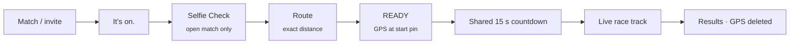

<p align="center">
  
</p>

<p align="center">
  <b>Same clock. Different streets. Fastest finish wins.</b><br>
  Simultaneous remote racing for friends across the world, or for verified strangers.
</p>

<p align="center">
  
  
  
  
  
</p>

---

## The race

Two runners, anywhere in the world, start at the **same second** on routes of the **same length**, each on streets near home. Live progress goes head-to-head on a shared race track, and the fastest verified time wins.

| | **Friend race** | **Open match** |
|---|---|---|
| Find a rival | Four-digit code or invite link | Global queue, matched by distance |
| Verification | None | Fresh **World ID Selfie Check** every race |
| During the race | See each other’s live position and progress | Progress only, never location |
| Distances | 1 · 3 · 5 · 10 km | 1 · 3 · 5 · 10 km |

### One screen, start to finish



- **Exact-distance routes:** every route is cut to the preset length along its own path (the server accepts it only within 5 m), so a 5 km in Tokyo equals a 5 km in Toronto. Elevation gain is shown side by side.
- **Start-line check:** a map shows live GPS against your start pin, and READY unlocks when you’re on the line.
- **Server-owned clock:** one scheduled start for both phones, and the clock keeps running through GPS loss.
- **Fair-play scoring:** each GPS fix is matched to the runner’s private route. A result is invalid after more than 60 s off route or a GPS gap over 2 min, and a runner who goes silent for 10 min gets a DNF.
- **Privacy by default:** precise GPS points are deleted as soon as results are saved; only a summary (time, outcome, elevation) is kept.

---

## Why World ID, and why only Selfie Check

**The event that needs trust:** two strangers are matched, then share a start time and live race progress with each other. Before that happens, each needs to know the other is a **real, unique person, present right now**, not a bot, a farmed account, or someone replaying an old session.

**Why Selfie Check is the minimum sufficient assurance:** it proves liveness and uniqueness with a fresh presence check, while revealing nothing about who the runner is. An ID credential would prove more than a running race needs, and friends who already know each other need no check at all.

**How it’s enforced (on the server, not in the UI):**
1. A match is made, and each runner has **6 minutes** to verify.
2. The server signs a race-scoped IDKit request: the action and signal are tied to this race and this runner, and the request expires after 5 minutes.
3. The proof is verified with World’s v4 verify API. Rivalry stores **only the outcome**, never the proof, the selfie, or any identity data.
4. The database refuses to generate a route or accept READY until the Selfie Check passes.

**Alternative paths:**
| Path | What happens |
|---|---|
| Runner declines the match | Match cancelled; the other runner returns to the queue automatically |
| Proof rejected or expired | Match cancelled; the other runner returns to the queue |
| Runner never verifies (6 min) | Match cancelled by the server sweep; whoever did verify is requeued |
| iOS reclaims the World ID connection mid-check | App detects it and offers a fresh attempt |

---

## How it’s made

Rivalry is an **Expo (React Native, TypeScript)** app for iPhone and Android. Users sign in by email with **Privy**. The backend runs on **Supabase**: Postgres plus Deno Edge Functions. Each function checks the user’s Privy login token itself, and the database tables are closed to direct access from the app. Matching, readiness, the countdown, scoring and results are all handled in SQL functions, so both phones always see the same race state. A **pg_cron** job cleans up abandoned races and deletes precise GPS points once results are saved.

Routes come from **openrouteservice**, trimmed to the exact race distance along their own path. During the race, the server matches each GPS fix to the runner’s own private route, and friends see each other’s position while strangers see only progress.

**Hacky bits:** IDKit’s WebAssembly runtime runs in a hidden WebView that hands the World ID link back to the app (React Native’s Hermes engine has no WebAssembly). A `postinstall` script patches Expo’s native iOS module so the app builds with an older Xcode. And the 10 km race is a 5 km loop run twice.

```
mobile/                 Expo app (src/app = screens, src/components = race flow, track, World check)
supabase/migrations/    Schema and every race state transition as SQL functions
supabase/functions/     runner-profile · friend-races · stranger-races · route-preview · race-progress · world-verification
```

### Run it

```sh
# Server
npx supabase link --project-ref <ref> && npx supabase db push
npx supabase secrets set PRIVY_APP_ID=... PRIVY_VERIFICATION_KEY=... ORS_API_KEY=... \
  WORLD_APP_ID=app_... WORLD_RP_ID=rp_... WORLD_SIGNING_KEY=... WORLD_ID_ENVIRONMENT=sandbox \
  WORLD_STAGING_VERIFICATION_TOKEN=...
for f in runner-profile friend-races stranger-races route-preview race-progress world-verification; do npx supabase functions deploy $f; done

# App (copy mobile/.env.example to mobile/.env first)
cd mobile && npm ci && npm run android   # or: npm run ios
```

Full server notes are in [`supabase/README.md`](supabase/README.md). Development builds are required; the app uses native modules that Expo Go doesn’t include.

---

## World ID integration debrief

**Time to first success:** about **2.5 hours** from starting the World integration to the first verified Selfie Check proof on a physical Android phone, and **~55 minutes** after the Developer Portal credentials were in place. Race-scoped verification on both phones, including the iPhone via the TestFlight Sandbox app, followed that evening, and the first stranger race with both runners verified by World started soon after.

**Friction encountered**
- **No IDKit path for React Native / Hermes.** The old React Native package is deprecated, and `@worldcoin/idkit-core` needs WebAssembly, which Hermes doesn’t have (`WebAssembly doesn't exist`). I run IDKit in a hidden WebView and pass messages across, which works but feels like a workaround.
- **Sandbox proofs were rejected after a successful check.** The Sandbox app said “verified”, but World’s verify API returned HTTP 403. The real reason (`environment_not_allowed: staging verification is not open for this app`) only surfaced after I forwarded World’s raw error fields; at first all I saw was a generic rejection. The fix, a **24-hour staging window** opened through the Developer Portal MCP tool plus an `x-staging-verification-token` header, wasn’t visible in the portal UI or the Sandbox guide I followed.
- **The window expires.** Sandbox verification stops working 24 hours later unless it’s reopened, which is easy to miss before a demo.
- **Official ID can’t be tested.** The Sandbox app shows passport and national ID credentials as “coming soon”, so a credential tier I had planned was untestable. I dropped it and made Selfie Check the only credential.
- **Failures inside the World app are invisible to the relying party.** On iOS, the first Selfie Check failed on an error page inside the Sandbox app after the selfie. Rivalry received nothing, no error code or status, just a pending request until it timed out. The same phone passed 30 minutes later.
- **Mobile round trips are fragile.** The request is polled from the app while the World app has the camera, and iOS can reclaim the background WebView. I added recovery, but the flow has no way to resume a request.

**Missing capability / documentation**
- A first-party IDKit for **Expo / React Native** (a native module, or a build without WebAssembly).
- The staging-verification window and its token header documented in the **Sandbox testing guide** and switchable in the **portal UI**.
- A way for the relying party to see **why a check failed inside the World app** (a status or error on the bridge/poll response).
- Official ID / passport credentials available in **Sandbox**.

**The one improvement with the greatest impact:** make Sandbox proofs verifiable **by default**, with no hidden, expiring staging window, or at least put the window and its header in the portal UI and the Sandbox guide. This single issue took the most time, happened *after* World’s own app showed success (so it looked like my bug), could only be fixed through the MCP tool, and silently breaks again every 24 hours.

---

<p align="center"><sub>Built for the Tokyo hackathon · Sandbox verification is used for development and demos.</sub></p>
